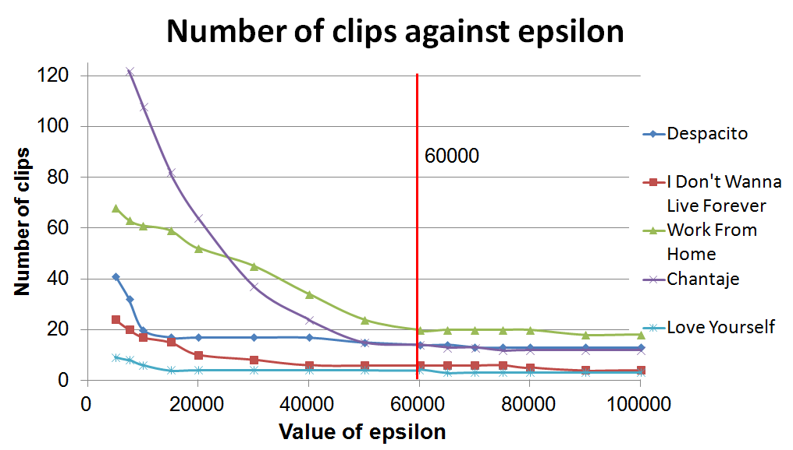

# FacialDataCollector
This application focuses on extracting segments of video with facial recognition and cutting them to form a database of videos.

This application consists of:
GUI : sdf
Error Algorithms: for calculating continuous frames

#### Dependencies:
To use the application, install Python 2.7
This project depends on a few python libraries:
- numpy
- matplotlib
- imageio
- ffprobe
- moviepy
- PIL (installed together with moviepy)
- cv2

To install the first five libraries, run the following:
pip install numpy matplotlib imageio ffprobe moviepy

To install cv2, please follow the instructions [here](http://opencv-python-tutroals.readthedocs.io/en/latest/py_tutorials/py_setup/py_setup_in_windows/py_setup_in_windows.html).

#### Error Function for Continuous Frames:
FacialDataCollector uses two error values to judge continuity
- Face Error
The sum of squares of differences of rectangles marking out faces in adjacent frames.
- Pixel Error
The sum of the difference in pixels of adjacent frames.
See Report_FINAL.pdf for more information.

Epsilon (error threshold) is determined based on the following graph, where the number of clips obtained is minimum.

For effective data collection, epsilon is set to be 60000.
To set it to other value, change the datacollector.process_video() function.

Time step allowances 0.1 0.2 0.3

Error value plot a graph

Pictures of finished programs.

Performance indicator
How much time it takes to process a how many second video

Sample AI

How to operate the thing
video format accepted mp4

Error handling:
  File "C:\Python27_64\lib\site-packages\imageio\plugins\ffmpeg.py", line 444, in _terminate
    self._proc.kill()
  File "C:\Python27_64\lib\subprocess.py", line 1019, in terminate
    _subprocess.TerminateProcess(self._handle, 1)
WindowsError: [Error 5] Access is denied

line 444 change
self._proc.kill()
to 

try:
    self._proc.kill()
except WindowsError:
    pass

Exception in Tkinter callback
Traceback (most recent call last):
  File "C:\Python27_64\lib\lib-tk\Tkinter.py", line 1410, in __call__
    return self.func(*args)
  File "C:\Jianzhi Home\Programming\FacialDataCollector\gui.py", line 90, in browse_vid
    self.vid_name = os.path.split(vidx.name)[1]
AttributeError: 'NoneType' object has no attribute 'name'

need to handle instances where no file is selected, can be dealt using try

insert screenshots of project

